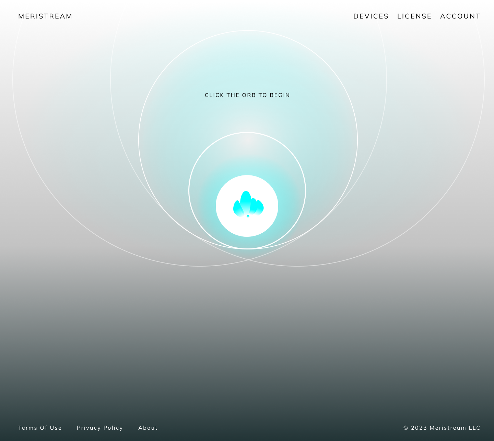

# Meristream SaaS

## Description

This Meristream Dummy version is a model of the existing SaaS platform for <a href="https://www.meristream.com/">Meristream</a> that leverages Supabase (PostgreSQL), Next.js for server-side rendering, React.js for client-side rendering, Stripe API for payments integration, and Tailwind CSS for styling. Meristream's application is as simple as pressing a button to play from there, the user will be immersed with infinite calming sounds through the meditative music algorithm that evolves the same way a relaxation music playlist would, with shifting keys and variation and textures, but all procedurally so you don't have to do a single thing.

## Demo



## Features

- Secure user management and authentication with [Supabase](https://supabase.io/docs/guides/auth)
- Powerful data access & management tooling on top of PostgreSQL with [Supabase](https://supabase.io/docs/guides/database)
- Integration with [Stripe Checkout](https://stripe.com/docs/payments/checkout) and the [Stripe customer portal](https://stripe.com/docs/billing/subscriptions/customer-portal)
- Automatic syncing of pricing plans and subscription statuses via [Stripe webhooks](https://stripe.com/docs/webhooks)

## Architecture


## Getting Started

### Local Development

1. Clone the repository to your local machine.
2. Install dependencies:

```bash
npm install
# or
yarn
```
1. 
Set up environment variables locally using the Vercel CLI:

```
vercel login
vercel link
vercel env pull .env.local
```
Set the SUPABASE_SERVICE_ROLE_KEY manually from your Supabase dashboard (Settings > API).

Use the Stripe CLI to test webhooks:

```
stripe listen --forward-to=localhost:3000/api/webhooks
```

Set STRIPE_WEBHOOK_SECRET to the webhook secret in your .env.local file.

Run the development server:
```
npm run dev
# or
yarn dev
```

Navigate to http://localhost:3000 in your browser to see the application rendered.

###### Going Live
1. Archive all test mode Stripe products.
2. Configure production environment variables in Vercel.
3. Redeploy your project in Vercel.
